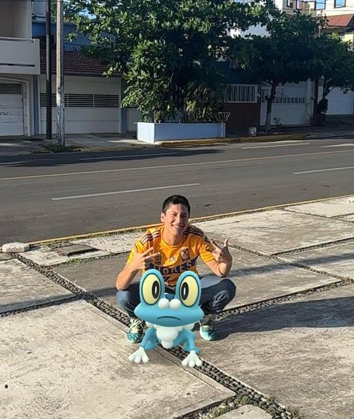

#Pedro Emmanuel Garcia Elvira

Soy pedro, actualmente estudiante de ingeniería mecatrónica, soy de Veracruz, viví muchos años en mexico y posteriormente en acapulco, tengo 17 años, me gusta cocinar, dibujar y leer.

##Logros importantes.

Clasifique como apto en el examen de conocimientos para la Escuela Naval y después participe en la fase definitiva 2025, la cual también clasifique como apto, pero rechace la oferta academica.

Jefe de grupo por un año completo en mi anterior escuela.

###Contacto
Correo: pedroemmanuel.garcia@iberopuebla.mx
Chat: 205389@iberopuebla.mx